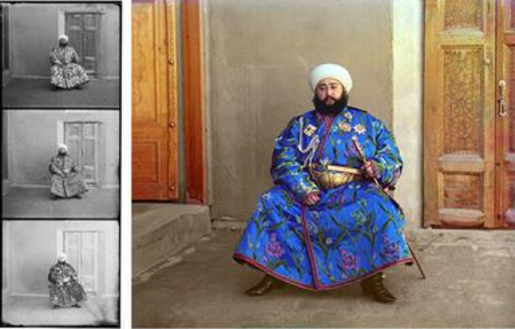

# Colorizing-Prokudin-Gorskii-images-of-the-Russian-Empiren-usning-MATLAB

## Abstract
The goal of this project is to take RGB  individual images and with some image  processing techniques, to automatically  produce a color image.
In order to do this,  we will need to extract the three-color  channel images, place them on top of each  other, and align them so that they form a  single RGB color image. 

## 1- Background: 
Sergei Mikhailovich Prokudin-Gorskii (1863-1944) was a photographer who, between the years 
1909-1915, traveled the Russian empire and took thousands of photos of everything he saw. He 
used an early color technology that involved recording three exposures of every scene onto a 
glass plate using a red, green, and blue filter. Back then, there was no way to print such photos, 
and they had to be displayed using a special projector. Prokudin-Gorskii left Russia in 1918. His 
glass plate negatives survived and were purchased by the Library of Congress in 1948. Today, a 
digitized version of the Prokudin-Gorskii collection is available online. 

## 2- Overview: 
The goal of this mini project is to learn to work with images in MATLAB by taking the digitized 
Prokudin-Gorskii glass plate images and automatically producing a color image with as few 
visual artifacts as possible. In order to do this, you will need to extract the three-color channel 
images, place them on top of each other, and align them so that they form a single RGB color 
image. 

## 3- Steps: 
a- Divide the image into three equal parts (channels). 
b- Aligning two of the channels to the third (try different orders). display the colorized output and 
report the (x,y) displacement vector that was used to align the channels. 
c- SSD: Score each one using some image matching metric, and take the displacement with the best 
score. Use the sum of squared differences (SSD) to score how well the images match.
d- Improving the SSD method
e- NCC: Using the normalized cross-correlation (NCC) to over come the problem of brightness. 

## 5- Bonus steps Points: 
e- Multiscale alignment: use an image pyramid to implement a faster search procedure to search over 
all possible displacements will become prohibitively expensive. 
f- Additional ideas may improve the quality of the colorized images such dealing with the borders of 
the photograph. 

## 6- Instruction’s implementation: 
5.1 Extract R, G and B channels.
5.2 Mutual alignment between channels. 
5.3.1 The sum of squared differences (SSD). 
5.3.2 Improving the SSD method.
5.4 the normalized cross-correlation (NCC). 
5.5 [BONUS POINT] pyramid approach. 

## 6- Conclusion: 
 
From the previous results which we obtained it from make a combination of the three 
channels, using the alignment through using the sum of squared differences (SSD) the 
normalized cross-correlation (NCC) or using the pyramid approach we find that no certain 
method give us best quality for all the Prokudin-Gorskii glass plate images but every method 
have its cons and pros in certain area such as using the sum of squared differences (SSD) on the 
image( 00125v.gif) it gives results close to the results which obtained from the normalized 
cross-correlation (NCC) but in the pyramid the results have less quality then the two methods. 
So, it is up to you to choose whose is the best depend on your input images. 
